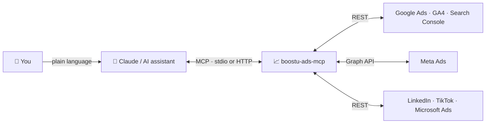

# 📈 BoostU Ads MCP

### The open-source MCP server for performance marketers. Google Ads, Meta Ads, GA4, Search Console, LinkedIn Ads, TikTok Ads and Microsoft Ads in one server, for Claude and other AI assistants. 🤖

[](https://github.com/boostuagency/boostu-ads-mcp/actions/workflows/ci.yml)
[](https://www.npmjs.com/package/boostu-ads-mcp)
[](https://nodejs.org)
[](https://modelcontextprotocol.io)
[](#-available-tools)
[](LICENSE)
[](https://boostu.be)

---

## 💡 What is this?

`boostu-ads-mcp` is a [Model Context Protocol](https://modelcontextprotocol.io) server that puts your advertising and analytics accounts inside Claude Desktop, Claude Code, Cursor, Windsurf and any other MCP client. Ask in plain language for a campaign report, a cross-channel ROAS comparison, a search terms audit or a budget pacing check, and the server runs the right API calls.

It is built by [BoostU](https://boostu.be), a Belgian performance marketing agency, and used daily on dozens of client accounts. Agencies work through a Google Ads manager account (MCC) and a Meta Business Manager, so every tool takes an account id and `find_client_accounts` locates a client on every channel by name.

> ### Prefer not to self-host?
> Use the managed edition at **[ads-mcp.boostu.be](https://ads-mcp.boostu.be)**: magic-link login, a dashboard to connect your own Google, Meta, LinkedIn, TikTok and Microsoft credentials, encrypted token storage and a one-click connector for Claude. Free during the preview.
>
> This repository is the MCP server itself. The hosted edition runs the same `createServer()` per customer.

| | Self-host (this repo) | Managed ([ads-mcp.boostu.be](https://ads-mcp.boostu.be)) |
|---|---|---|
| **Price** | Free, MIT-licensed | Free preview, then paid |
| **Setup** | Your own API credentials in `.env`, run via `npx` | Paste credentials in a dashboard, copy one connector URL |
| **Tokens** | You manage them | Encrypted at rest, rotated for you |
| **Best for** | Developers, agencies with an engineer | Marketers and teams without one |

---

## 🔌 How it works



Your data stays in the ad platforms; this server only brokers the calls with your own credentials.

---

## ✨ Highlights

- 🔎 **Google Ads**: full GAQL access plus ready-made reports (campaigns, ad groups, keywords with quality score, search terms, ads with RSA assets, device/hour/network breakdowns), budget pacing, change history, recommendations, conversion actions and Keyword Planner ideas
- 📘 **Meta Ads**: Insights with breakdowns and attribution windows, campaigns, ad sets with targeting, ads with creatives, raw Graph API access
- 📊 **GA4 and Search Console**: reports with period comparison, channel overview, realtime, custom definitions, property audit, search queries and pages, URL inspection, sitemaps
- 💼 **LinkedIn, TikTok and Microsoft Ads**: account lists, performance reports (incl. LinkedIn demographics) and campaign lists
- 🌐 **Cross-channel**: one call for spend, conversions, CPA and ROAS per client across every ad platform, with previous-period comparison, plus an all-accounts overview for daily checks
- 🛡️ **Safe writes**: pausing, budgets, keywords and raw mutations always return a preview first (Google `validateOnly`, Meta `validate_only`) and only execute with `confirm=true`; every executed write emits an audit event
- 🏷️ **Client registry**: optional JSON file that maps client names to their accounts per channel, with owners and CPA/ROAS targets
- 🧩 **Library and binary**: `npx boostu-ads-mcp` for stdio, `--http` for a self-hosted endpoint, or `import { createServer }` to embed it in your own multi-tenant service

---

## 🚀 Quick start

```bash
npx boostu-ads-mcp            # stdio
npx boostu-ads-mcp --http     # Streamable HTTP on $PORT/mcp, protected by MCP_API_KEYS
```

Every platform is optional: configure only the credentials you have and the matching tools appear. See [docs/AUTHENTICATION.md](docs/AUTHENTICATION.md) for how to get each credential.

### Claude Desktop

Add to `~/Library/Application Support/Claude/claude_desktop_config.json` (macOS) or `%APPDATA%\Claude\claude_desktop_config.json` (Windows):

```json
{
  "mcpServers": {
    "ads": {
      "command": "npx",
      "args": ["-y", "boostu-ads-mcp"],
      "env": {
        "GOOGLE_OAUTH_CLIENT_ID": "...",
        "GOOGLE_OAUTH_CLIENT_SECRET": "...",
        "GOOGLE_REFRESH_TOKEN": "...",
        "GOOGLE_ADS_LOGIN_CUSTOMER_ID": "1234567890",
        "META_ACCESS_TOKEN": "..."
      }
    }
  }
}
```

### Claude Code

```bash
claude mcp add ads -e GOOGLE_OAUTH_CLIENT_ID=... -e GOOGLE_OAUTH_CLIENT_SECRET=... \
  -e GOOGLE_REFRESH_TOKEN=... -e META_ACCESS_TOKEN=... -- npx -y boostu-ads-mcp
```

Or against a self-hosted HTTP instance:

```bash
claude mcp add --transport http ads https://your-host/mcp --header "Authorization: Bearer <MCP_API_KEYS key>"
```

### Cursor / Windsurf

Same `command`/`args`/`env` block as Claude Desktop in `~/.cursor/mcp.json` or `~/.codeium/windsurf/mcp_config.json`.

### Docker / Railway

```bash
docker build -t boostu-ads-mcp .
docker run -p 3000:3000 --env-file .env -e MCP_API_KEYS=me:long-random-secret boostu-ads-mcp
```

The image runs `--http` mode with a `/health` endpoint, so it deploys as-is on Railway, Fly.io or Render.

### As a library

```ts
import { createServer } from "boostu-ads-mcp";

const server = createServer({
  credentials: { meta: { accessToken: process.env.META_ACCESS_TOKEN! } },
  user: { id: "alice@example.com" },
  writeMode: "confirm",
  onAudit: (event) => myLogger.info(event),
});
// connect any MCP transport, e.g. StreamableHTTPServerTransport per request
```

`createServer` is cheap: OAuth access tokens and account lists are cached per credential across instances, so a server per HTTP request is fine. This is how the hosted edition serves many customers.

---

## 💬 Example prompts

- "Which Google Ads accounts under our MCC spent nothing yesterday?"
- "Cross-channel report for Bakkerij Janssens for last month, compared with the month before."
- "Show the search terms without conversions that cost more than 20 euro in the last 30 days and propose negative keywords."
- "Meta: which ad sets of client X have a CPA above 40 euro in the last 14 days, split by age?"
- "Compare GA4 conversions per channel with what Google Ads and Meta report themselves."
- "Pause these three keywords." (you get a preview first, then confirm)

Built-in prompts: `client_report`, `google_ads_audit`, `wasted_spend`, `daily_check`.

---

## ⚙️ Configuration

All variables are listed in [`.env.example`](.env.example).

| Variable | Purpose |
|---|---|
| `GOOGLE_OAUTH_CLIENT_ID`, `GOOGLE_OAUTH_CLIENT_SECRET`, `GOOGLE_REFRESH_TOKEN` | Google Ads, GA4 and Search Console (one Google user) |
| `GOOGLE_ADS_LOGIN_CUSTOMER_ID` | Your manager account (MCC) id |
| `GOOGLE_ADS_DEVELOPER_TOKEN` | Optional: Google sunset developer tokens on 9 Sep 2026; access now follows your Cloud project |
| `META_ACCESS_TOKEN`, `META_APP_SECRET`, `META_BUSINESS_ID` | Meta Marketing API (system user token recommended) |
| `LINKEDIN_*` | Access token, or client id + secret + refresh token |
| `TIKTOK_ACCESS_TOKEN`, `TIKTOK_APP_ID`, `TIKTOK_APP_SECRET` | TikTok Business API |
| `MICROSOFT_ADS_*` | Developer token, Entra app, refresh token, manager customer id |
| `WRITE_MODE` | `confirm` (default) or `off` to hide every write tool |
| `WRITE_ALLOWED_USERS` | In `--http` mode: only these API key names may execute writes |
| `CLIENTS_JSON` / `CLIENTS_FILE` | Client registry, see [`clients.example.json`](clients.example.json) |
| `MCP_API_KEYS` | `--http` mode: `name:key,name2:key2` |
| `REPORT_TIMEZONE` | Time zone for date presets (default `Europe/Brussels`) |
| `GOOGLE_ADS_API_VERSION`, `META_API_VERSION`, `LINKEDIN_API_VERSION` | Pin API versions (defaults `v25`, `v26.0`, `202609`) |

---

## 🧰 Available tools

### Cross-channel and clients

| Tool | Type | What it does |
|---|---|---|
| `boostu_status` | read | Shows which platforms this MCP server is connected to and how many clients are in the client registry. |
| `list_clients` | read | Lists clients from the client registry with their account ids per channel, owner and targets (CPA/ROAS/budget). |
| `find_client_accounts` | read | Searches the client registry AND the live account lists of every connected platform (Google Ads MCC, Meta, LinkedIn, TikTok, Microsoft Ads, GA4, Search Console) for a client name. |
| `cross_channel_performance` | read | Spend, impressions, clicks, conversions, conversion value, CTR, CPC, CPA and ROAS per ad account and summed (per currency) across Google Ads, Meta, LinkedIn, TikTok and Microsoft Ads. |
| `agency_overview` | read | Totals per active ad account across ALL clients on the selected platforms, for agency-wide checks such as 'which accounts spent nothing yesterday', 'top spenders this month' or 'accounts with CPA above X'. |

### Google Ads

| Tool | Type | What it does |
|---|---|---|
| `google_ads_list_accounts` | read | Lists every Google Ads account under the configured manager account (MCC) (customer_client hierarchy) with id, name, status, currency and whether it is a manager. |
| `google_ads_query` | read | Runs any Google Ads Query Language (GAQL) SELECT against a client account. |
| `google_ads_account_performance` | read | Account-level KPIs (cost, impressions, clicks, CTR, CPC, conversions, value, CPA, ROAS) for a period, optionally split per day/week/month. |
| `google_ads_campaign_performance` | read | Per-campaign KPIs with status, channel type, bidding strategy and daily budget. |
| `google_ads_ad_group_performance` | read | Per-ad-group KPIs, optionally limited to campaigns. |
| `google_ads_keyword_performance` | read | Keyword KPIs incl. |
| `google_ads_search_terms` | read | Actual search queries that triggered ads, with KPIs. |
| `google_ads_ad_performance` | read | Ads with type, status, ad strength, approval status, final URLs, RSA headlines/descriptions and KPIs. |
| `google_ads_breakdown` | read | Campaign KPIs split by a segment: device, day of week, hour of day, network, conversion action or date. |
| `google_ads_budget_pacing` | read | For each enabled campaign: daily budget, month-to-date spend, expected spend so far, projected month spend and pacing %. |
| `google_ads_change_history` | read | Recent changes in the account (who changed what, when). |
| `google_ads_recommendations` | read | Open optimization recommendations from Google (type, campaign, impact estimate). |
| `google_ads_conversion_actions` | read | Conversion actions with status, category, type, primary/secondary, counting and attribution model, plus conversions in the period. |
| `google_ads_keyword_ideas` | read | Keyword ideas with average monthly searches, competition and top-of-page bid range from Keyword Planner. |
| `google_ads_set_status` | ✏️ write | Pause or enable campaigns, ad groups, ads or keywords. |
| `google_ads_update_campaign_budget` | ✏️ write | Sets the daily budget (account currency) of the budget attached to a campaign. |
| `google_ads_add_negative_keywords` | ✏️ write | Adds negative keywords to a campaign (campaign_id) or an ad group (ad_group_id). |
| `google_ads_add_keywords` | ✏️ write | Adds (positive) keywords to an ad group, optionally with a max CPC bid. |
| `google_ads_mutate` | ✏️ write | Escape hatch for any change the dedicated tools do not cover (bids, ad copy, assets, targeting, new campaigns...). |

### Meta Ads (Facebook and Instagram)

| Tool | Type | What it does |
|---|---|---|
| `meta_list_ad_accounts` | read | Lists all Meta (Facebook/Instagram) ad accounts the connected token / Business Manager can access, with status, currency and business. |
| `meta_insights` | read | Performance from the Meta Insights API at account, campaign, adset or ad level with optional breakdowns (age, gender, country, region, publisher_platform, platform_position, device_platform, impression_device) and daily/monthly split. |
| `meta_list_campaigns` | read | Campaigns of an ad account with status, objective, buying type, bid strategy and budgets (converted to currency units). |
| `meta_list_adsets` | read | Ad sets with status, optimization goal, billing event, bid strategy, budgets, schedule and targeting. |
| `meta_list_ads` | read | Ads with status, review feedback and creative details (headline, primary text, link, CTA, image/thumbnail URL). |
| `meta_graph_get` | read | Read anything from the Meta Graph / Marketing API: e.g. |
| `meta_set_status` | ✏️ write | Sets status ACTIVE or PAUSED on campaigns, ad sets or ads (any mix of ids). |
| `meta_update_budget` | ✏️ write | Changes the daily or lifetime budget (in account currency units, e.g. |
| `meta_graph_post` | ✏️ write | Escape hatch for any Marketing API write (create campaign/ad set/ad, update bids, targeting, creatives, audiences...). |

### Google Analytics 4

| Tool | Type | What it does |
|---|---|---|
| `ga4_list_properties` | read | Lists all Google Analytics 4 accounts and properties the connected Google user can access. |
| `ga4_run_report` | read | Runs a GA4 Data API report. |
| `ga4_traffic_overview` | read | Quick overview per default channel group (or source/medium or campaign): sessions, users, engagement rate, key events, transactions and revenue. |
| `ga4_realtime_report` | read | Active users in the last 30 minutes, optionally split by a realtime dimension (country, deviceCategory, unifiedScreenName, eventName, minutesAgo). |
| `ga4_get_metadata` | read | Lists dimensions and metrics available for a property, including custom definitions. |
| `ga4_property_config` | read | Property settings plus key events (conversions), data streams and Google Ads links. |

### Google Search Console

| Tool | Type | What it does |
|---|---|---|
| `gsc_list_sites` | read | Lists all Search Console properties the connected Google user can access. |
| `gsc_search_analytics` | read | Clicks, impressions, CTR and average position by query, page, country, device, date or searchAppearance. |
| `gsc_inspect_url` | read | Index status, canonical, crawl info, mobile usability and rich results of one URL. |
| `gsc_list_sitemaps` | read | Submitted sitemaps with last download, errors, warnings and indexed counts. |

### LinkedIn Ads

| Tool | Type | What it does |
|---|---|---|
| `linkedin_list_ad_accounts` | read | Lists LinkedIn Campaign Manager ad accounts the connected user can access, with status and currency. |
| `linkedin_list_campaigns` | read | Campaigns of an ad account with status, objective, type, cost type, daily/total budget and campaign group. |
| `linkedin_analytics` | read | LinkedIn ad performance grouped by one pivot: ACCOUNT, CAMPAIGN_GROUP, CAMPAIGN, CREATIVE, or a professional demographic (MEMBER_JOB_FUNCTION, MEMBER_SENIORITY, MEMBER_INDUSTRY, MEMBER_COMPANY_SIZE, MEMBER_COMPANY, MEMBER_JOB_TITLE, MEMBER_COUNTRY_V2, MEMBER_REGION_V2). |
| `linkedin_get` | read | Raw GET on the LinkedIn Marketing REST API (versioned, Rest.li 2.0). |
| `linkedin_update_campaign` | ✏️ write | Pause/activate a LinkedIn campaign and/or change its daily budget (account currency). |

### TikTok Ads

| Tool | Type | What it does |
|---|---|---|
| `tiktok_list_advertisers` | read | Lists TikTok Ads advertiser accounts authorised for the connected app. |
| `tiktok_report` | read | TikTok Ads report at advertiser, campaign, ad group or ad level. |
| `tiktok_list_campaigns` | read | Lists campaigns, ad groups or ads of an advertiser with status, objective, budget and settings. |
| `tiktok_get` | read | Raw GET on the TikTok Business API v1.3, e.g. |
| `tiktok_set_status` | ✏️ write | Enable or disable TikTok campaigns, ad groups or ads. |
| `tiktok_update_budget` | ✏️ write | Changes the budget of a TikTok campaign or ad group (account currency). |

### Microsoft Advertising

| Tool | Type | What it does |
|---|---|---|
| `microsoft_ads_list_accounts` | read | Lists Microsoft Advertising (Bing) accounts under the connected manager account. |
| `microsoft_ads_report` | read | Runs a Microsoft Ads report (async, can take up to a minute). |
| `microsoft_ads_list_campaigns` | read | Campaigns of an account with status, type, budget and bidding scheme. |
| `microsoft_ads_update_campaigns` | ✏️ write | Pause or activate campaigns and/or set their daily budget. |
---

## 🛡️ Safety model

- Read tools are annotated `readOnlyHint: true`; write tools `readOnlyHint: false` (and `destructiveHint` for raw mutations).
- Every write tool has a `confirm` flag. Without it the tool returns a preview and changes nothing; Google Ads previews run `validateOnly`, Meta previews `execution_options=["validate_only"]`.
- `WRITE_MODE=off` removes all write tools; `canWrite` (library) or `WRITE_ALLOWED_USERS` (HTTP mode) limits who may execute them.
- Executed writes emit an audit event (`{"type":"audit", user, tool, args, ok}`) on stdout or to your `onAudit` callback.
- Responses above `MAX_RESPONSE_CHARS` are truncated with a hint to narrow the query, to protect the model's context.

---

## 🧑‍💻 Development

```bash
npm install
npm run dev          # stdio via tsx
npm run dev:http     # HTTP via tsx
npm test             # vitest
npm run typecheck
```

See [CONTRIBUTING.md](CONTRIBUTING.md) and [RELEASING.md](RELEASING.md).

---

## 📄 License

MIT, see [LICENSE](LICENSE). Built and maintained by [BoostU](https://boostu.be). Security issues: see [SECURITY.md](SECURITY.md).
